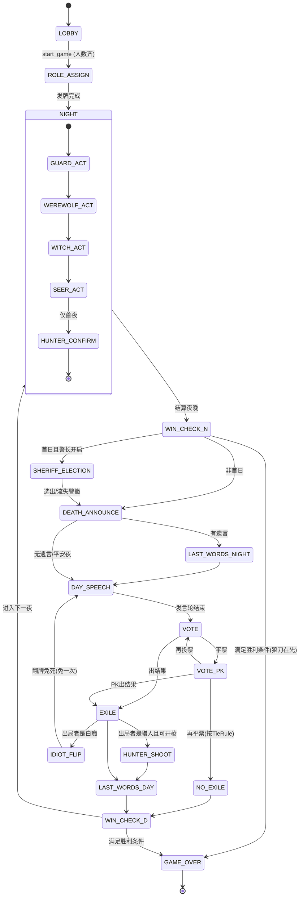

# AI Agent 狼人杀游戏平台 — 需求文档与技术设计规格（PRD + Technical Design）

> 面向 Code Agent 的开发蓝图 · v1.0 · 2026-07-05
> 文档语言：中文；代码标识符、API 命名、schema 用英文。

---

## 1. 项目概述与目标

### 1.1 项目定位
构建一个**模拟狼人杀（Werewolf / Mafia 社交推理游戏）的多智能体对局平台**。平台的每个座位（seat）由一个"玩家"占据，玩家既可以是 **AI Agent**（通过 LLM 驱动），也可以是**真人**——两者通过**同一套标准玩家 API** 接入。平台内置一个**规则引擎（rule engine）**，支持可配置的板子（role setup）、胜利条件、警长机制、发言与投票规则等。

平台通过**工具调用（tool calling）范式**驱动 Agent：Agent 调用只读工具（如 `get_game_state`、`get_speeches`）观察局面，调用行动工具（如 `speak`、`vote`、`night_action`）执行游戏操作。服务器是唯一的"上帝/法官（Game Master, GM）"，负责裁决、信息隔离与状态推进。

前端默认提供**上帝视角（spectator / god view）**的直播与回放，也可切换为**某玩家视角**，此时严格执行信息隔离。

### 1.2 核心目标
1. **规则准确、可配置**：规则引擎必须准确实现中国流行的狼人杀规则（警徽流、屠边/屠城、同守同救、女巫双药规则、猎人开枪时机等），并以 `GameConfig` 完全参数化。
2. **model-agnostic**：LLM 调用层与具体模型解耦，可切换 OpenAI / Anthropic / Gemini / 开源模型 / 本地 Ollama。
3. **真人与 Agent 同构接入**：统一的回合制玩家协议，AI 与真人客户端走同一 API。
4. **可回放**：基于事件溯源（event sourcing），所有对局可完整重放。
5. **信息隔离**：服务端计算每个视角的 observation，绝不向客户端泄露越权信息。

### 1.3 设计原则（对 Code Agent 的硬性约束）
- **Game engine 是纯函数逻辑，零 IO**：引擎输入 `(state, action)`，输出 `(new_state, events)`，不触碰网络/数据库/LLM。这使规则可单元测试、可确定性重放。
- **服务器是唯一事实来源（single source of truth）**：客户端/Agent 永远不自行裁决，只提交意图（intent），由引擎裁决。
- **所有随机性走单一 seeded RNG**：`GameConfig.seed` 决定发牌与平票随机，保证可复现。
- **一切状态变更都是一个 append-only Event**：状态 = `reduce(events)`。

---

## 2. 术语表（狼人杀术语中英对照）

| 中文 | English identifier | 说明 |
|---|---|---|
| 狼人 | `WEREWOLF` | 狼人阵营，夜晚杀人 |
| 村民/平民 | `VILLAGER` | 好人阵营，无技能 |
| 预言家 | `SEER` | 每夜查验一名玩家阵营（好人/狼人） |
| 女巫 | `WITCH` | 持解药（antidote）与毒药（poison），同夜不可双开 |
| 猎人 | `HUNTER` | 出局时可开枪带走一人（被毒杀则不能） |
| 守卫 | `GUARD` | 每夜守护一人，不能连守同一人；同守同救失效 |
| 白痴 | `IDIOT` | 被票出时翻牌免死，失去投票权但保留发言权 |
| 神职 | god role / special role | 有技能的好人 |
| 板子/配置 | role setup / `GameConfig` | 角色数量组合 |
| 屠边 | `KILL_SIDE` | 杀光所有村民 **或** 杀光所有神职即狼胜 |
| 屠城 | `KILL_ALL` | 杀光所有好人狼才胜 |
| 警长 | sheriff / `SHERIFF` | 标志牌，1.5 票 + 决定发言顺序 + 归票权 |
| 警徽流 | badge flow / `badge_flow` | 预言家公布未来两夜验人计划 |
| 上警/警上 | run for sheriff / candidate | 参与警长竞选 |
| 警下 | non-candidate | 不参与竞选，拥有投票权 |
| 退水 | withdraw | 放弃竞选，失去警长投票权 |
| 悍跳 | claim-jump / impersonate | 狼人冒认神职（通常预言家） |
| 倒钩 | counter-hook | 狼站队真预言家卖队友 |
| 查杀 | seer-kill result | 预言家验出的狼 |
| 金水 | verified-good | 预言家验出的好人 |
| 银水 | witch-saved | 女巫解药救过的人 |
| 遗言 | last words | 出局玩家的最后发言 |
| 归票 | vote-herding | 号召集中投票 |
| PK/平票 | tie / runoff | 平票进入 PK 发言与再投票 |
| 自爆 | self-destruct | 狼人白天翻牌，立即天黑 |
| 空刀 | no-kill | 狼人夜晚选择不杀 |
| 自刀 | self-knife | 狼人杀自己队友（骗药等） |
| 平安夜 | peaceful night | 夜晚无人出局 |
| 天黑/夜晚 | night phase | 角色行动阶段 |
| 天亮/白天 | day phase | 发言投票阶段 |
| 死讯 | death announcement | 公布夜晚出局 |

---

## 3. 游戏规则引擎设计

### 3.1 规则事实基础（来自调研，供 Code Agent 实现时对照）

以下规则细节经调研核实（口袋狼人杀、知乎、百度百科等公开资料一致确认），是规则引擎的默认（default）行为：

- **标准 12 人局"预女猎白"**：4 狼人 + 4 村民 + 预言家 + 女巫 + 猎人 + 白痴。好人胜利＝放逐所有狼人；狼人胜利＝屠边（杀光 4 村民 **或** 杀光 4 神职）。
- **12 人守卫局"预女猎守"**：白痴换成守卫。
- **标准 9 人局**：3 狼 + 3 民 + 预言家 + 女巫 + 猎人，可屠边或屠城（可配置）。9 人局常约定女巫**首夜可自救**，第二夜起不可自救。
- **夜晚唤醒/结算顺序**（默认）：守卫 → 狼人 → 女巫 → 预言家 → 猎人（仅首夜确认身份）/ 白痴（仅首夜确认）。注意：**女巫必须在狼人之后**（要拿到刀口信息）；守卫在狼人之前。
- **女巫规则**：解药 + 毒药，**同一夜只能用一瓶**，全局共两瓶。默认**全程不能自救**（首夜可自救为可配置项）。**解药用完后，法官不再告知女巫每晚的刀口**。
- **同守同救失效**：守卫守护 A + 女巫解药救 A 同夜作用于同一人，则 A 依旧死亡（"奶死"）。守卫**不能挡毒药**，只能挡狼刀。
- **猎人开枪**：被狼刀或被票出局可开枪带走一人；**被女巫毒死不能开枪**；情侣殉情不能开枪。猎人枪杀目标视为与猎人同时死亡。
- **白痴翻牌**：白天被票出可翻牌免死，保留发言权、**失去投票权**；此后只能被夜晚刀杀/毒杀/枪杀出局。
- **狼刀在先原则**：若狼人杀人后已达成胜利条件，直接判狼胜，即使女巫随后毒杀/猎人开枪带走最后一只狼也无效。
- **狼人刀法**：允许空刀、允许自刀；意见不统一视为空刀。
- **警长竞选**：首个白天、**公布死讯前**进行。上警玩家依次发言→可退水（失去投票权）→警下投票→最高票当选。平票则平票者 PK 发言，再由未平票的警下投票；再次平票则**警徽流失**（本局无警长）。狼人可在竞选阶段自爆，导致**吞警徽**（本局无警长）。
- **警长权利**：投票算 **1.5 票**；决定发言方向（警左/警右，或死左/死右）；发言末尾**归票**；死亡时可**移交警徽或撕掉警徽**。
- **警徽流**：预言家上警时公布"先验 A 后验 B"（一般留两夜），死后靠警徽传递验人信息。
- **遗言规则**（默认标准局）：**仅首夜死者有遗言**（无论死几个）；之后夜晚死者无遗言；**所有白天被票/技能出局者都有遗言**。是否有遗言只取决于死亡时间，与死因无关。
- **发言顺序**：有警长时由警长定警左/警右；无警长时按"死者下家开始 + 单顺双逆"等约定（可配置）。第二天起换手（上一天警左则下一天警右）。
- **投票平票（放逐）**：平票者进入 PK 台再发言，PK 台下玩家再投（平票者不能投）；再次平票则**无人出局**，直接进入下一夜（可配置为"再随机/再PK"）。

> **注意（Code Agent）**：上述"默认"值全部要暴露为 `GameConfig` 可配置项；不同地区/平台村规差异极大，引擎不得把任何一条硬编码为不可变逻辑。

### 3.2 `GameConfig` schema（完整可配置项）

```python
from enum import Enum
from typing import Literal, Optional
from pydantic import BaseModel, Field

class RoleType(str, Enum):
    WEREWOLF = "WEREWOLF"
    VILLAGER = "VILLAGER"
    SEER = "SEER"
    WITCH = "WITCH"
    HUNTER = "HUNTER"
    GUARD = "GUARD"
    IDIOT = "IDIOT"
    # 预留扩展：WHITE_WOLF_KING, CUPID, KNIGHT ...

class WinCondition(str, Enum):
    KILL_SIDE = "KILL_SIDE"   # 屠边：杀光村民或杀光神职
    KILL_ALL  = "KILL_ALL"    # 屠城：杀光所有好人

class SpeechOrderRule(str, Enum):
    SHERIFF_DECIDES = "SHERIFF_DECIDES"      # 有警长由警长定警左/警右
    DEATH_NEXT      = "DEATH_NEXT"           # 从死者下家开始
    FIXED_CLOCKWISE = "FIXED_CLOCKWISE"      # 固定顺时针
    ODD_EVEN_CLOCK  = "ODD_EVEN_CLOCK"       # 单顺双逆（按时间/座号）
    BIDDING         = "BIDDING"              # 竞价发言（见 Agent 设计 4.3）

class TieRule(str, Enum):
    PK_THEN_NO_EXILE = "PK_THEN_NO_EXILE"    # PK 再平票则无人出局
    PK_THEN_RANDOM   = "PK_THEN_RANDOM"      # PK 再平票则随机
    NO_EXILE         = "NO_EXILE"            # 直接无人出局

class WitchRule(BaseModel):
    self_rescue_first_night: bool = False    # 首夜是否可自救
    self_rescue_always: bool = False         # 是否全程可自救
    two_potions_same_night: bool = False     # 同夜能否双开（默认否）
    knows_kill_after_antidote_used: bool = False  # 解药用完后是否仍告知刀口

class GuardRule(BaseModel):
    can_guard_self: bool = True
    can_guard_same_target_consecutively: bool = False   # 是否可连守
    guard_plus_antidote_cancels: bool = True            # 同守同救失效

class SheriffRule(BaseModel):
    enabled: bool = True
    vote_weight: float = 1.5
    election_before_first_death_announce: bool = True    # 竞选在公布死讯前
    badge_flow_enabled: bool = True                      # 警徽流
    wolf_selfdestruct_eats_badge: bool = True            # 自爆吞警徽

class LastWordsRule(str, Enum):
    FIRST_NIGHT_ONLY = "FIRST_NIGHT_ONLY"   # 仅首夜死者有遗言（默认）
    ALWAYS_NIGHT      = "ALWAYS_NIGHT"       # 每夜死者都有遗言
    N_EQUALS_WOLVES   = "N_EQUALS_WOLVES"    # 遗言数=狼数

class RoleSlot(BaseModel):
    role: RoleType
    count: int

class GameConfig(BaseModel):
    config_id: str
    name: str = "标准12人预女猎白"
    num_players: int = 12
    roles: list[RoleSlot] = Field(default_factory=lambda: [
        RoleSlot(role=RoleType.WEREWOLF, count=4),
        RoleSlot(role=RoleType.VILLAGER, count=4),
        RoleSlot(role=RoleType.SEER, count=1),
        RoleSlot(role=RoleType.WITCH, count=1),
        RoleSlot(role=RoleType.HUNTER, count=1),
        RoleSlot(role=RoleType.IDIOT, count=1),
    ])
    win_condition: WinCondition = WinCondition.KILL_SIDE
    # 夜间唤醒顺序（角色类型序列，引擎按此依次结算）
    night_order: list[RoleType] = Field(default_factory=lambda: [
        RoleType.GUARD, RoleType.WEREWOLF, RoleType.WITCH,
        RoleType.SEER, RoleType.HUNTER, RoleType.IDIOT,
    ])
    speech_order_rule: SpeechOrderRule = SpeechOrderRule.SHERIFF_DECIDES
    tie_rule: TieRule = TieRule.PK_THEN_NO_EXILE
    witch: WitchRule = Field(default_factory=WitchRule)
    guard: GuardRule = Field(default_factory=GuardRule)
    sheriff: SheriffRule = Field(default_factory=SheriffRule)
    last_words: LastWordsRule = LastWordsRule.FIRST_NIGHT_ONLY
    allow_wolf_self_knife: bool = True       # 允许自刀
    allow_wolf_empty_knife: bool = True      # 允许空刀
    wolf_first_kill_priority: bool = True    # 狼刀在先原则
    speech_timeout_sec: int = 90             # 单次发言超时
    action_timeout_sec: int = 45             # 夜间行动超时
    max_rounds: int = 20                     # 防止死循环
    seed: Optional[int] = None               # 随机种子（发牌/平票）
```

**内置预设板子（presets）**，Code Agent 应提供工厂函数 `build_preset(name)`：
- `"std_12_yn_hunter_idiot"`：预女猎白（默认）
- `"std_12_yn_hunter_guard"`：预女猎守
- `"std_9_kill_side"`：9 人屠边（预女猎，女巫首夜可自救）
- `"std_9_kill_all"`：9 人屠城

`GameConfig` 应有校验器 `validate_config()`：`sum(count) == num_players`；`night_order` 中的角色必须在 `roles` 中出现；胜利条件与角色组合相容。

### 3.3 游戏状态机（Phase State Machine）

引擎核心是一个显式的**阶段状态机**。推荐用 `python-statemachine` 库声明（其 `source.to(target, cond=...)` 守卫语义与本场景契合），或自实现一个 `Phase` 枚举 + 转移表。以下为完整阶段流转。



**阶段清单（`Phase` 枚举）**：`LOBBY, ROLE_ASSIGN, NIGHT_GUARD, NIGHT_WEREWOLF, NIGHT_WITCH, NIGHT_SEER, NIGHT_HUNTER_CONFIRM, WIN_CHECK, SHERIFF_ELECTION, SHERIFF_PK, DEATH_ANNOUNCE, LAST_WORDS, DAY_SPEECH, VOTE, VOTE_PK, EXILE, HUNTER_SHOOT, IDIOT_FLIP, GAME_OVER`。

**关键时序细节（供实现）**：
1. **首日特殊**：警长竞选在**公布死讯之前**（`sheriff.election_before_first_death_announce=True`）。竞选完成后才 `DEATH_ANNOUNCE`。
2. **狼刀在先**：`WIN_CHECK_N` 在夜晚结算后立即判定；若已满足则跳过一切后续（女巫毒、猎人枪无效）。
3. **夜晚结算算法**（伪代码，纯函数）：
```python
def resolve_night(state, night_actions) -> deaths:
    guarded  = night_actions.guard_target
    killed   = night_actions.wolf_target        # 可能为 None(空刀)
    saved    = night_actions.witch_save          # bool
    poisoned = night_actions.witch_poison_target
    deaths = set()
    # 狼刀
    if killed is not None:
        protected = (killed == guarded)          # 守卫挡刀
        rescued   = saved                         # 女巫救
        if protected and rescued and config.guard.guard_plus_antidote_cancels:
            deaths.add(killed)                    # 同守同救 -> 死
        elif protected or rescued:
            pass                                  # 活
        else:
            deaths.add(killed)
    # 毒药：守卫挡不住毒
    if poisoned is not None:
        deaths.add(poisoned)
    return deaths
```
4. **猎人开枪可用性**：`hunter_can_shoot = (死因 in {WOLF_KILL, EXILE}) and (死因 != WITCH_POISON)`。引擎在猎人出局时置 `pending_hunter_shoot`。
5. **白痴翻牌**：白痴首次被票出 → `idiot_revealed=True`，不出局，`can_vote=False`，回到 `DAY_SPEECH`（当天投票作废，进入下一夜）。

### 3.4 每个角色的技能定义与时序

| 角色 | 行动阶段 | 工具 `action_type` | 时序/约束 |
|---|---|---|---|
| 守卫 GUARD | NIGHT_GUARD | `guard` | 每夜守一人；不可连守同一人；可自守（可配）；先于狼人 |
| 狼人 WEREWOLF | NIGHT_WEREWOLF | `kill` | 队内共识；允许空刀/自刀；须在守卫后、女巫前 |
| 女巫 WITCH | NIGHT_WITCH | `save` / `poison` / `skip` | 拿到刀口后行动；同夜单药；解药用完后不再告知刀口；首夜自救可配 |
| 预言家 SEER | NIGHT_SEER | `check` | 每夜验一人，返回 `GOOD`/`WEREWOLF` |
| 猎人 HUNTER | NIGHT_HUNTER_CONFIRM（首夜确认）/ HUNTER_SHOOT（出局时） | `shoot` / `skip` | 被毒不能开枪 |
| 白痴 IDIOT | IDIOT_FLIP（被票时） | 自动/`flip` | 翻牌免死一次，失投票权 |
| 村民 VILLAGER | 无夜间技能 | — | 仅白天发言投票 |
| 全体 | DAY_SPEECH / VOTE / SHERIFF_* | `speak` / `vote` / `run_for_sheriff` / `withdraw` / `pass_badge` | — |

---

## 4. Agent 系统设计

### 4.1 交互协议：Agent 工具（Tools）JSON Schema

Agent 与服务器的全部交互抽象为**工具调用**。工具分两类：**只读观察工具（observation tools）**与**行动工具（action tools）**。服务器在轮到某 Agent 行动时，告知其**当前可用工具集**（依阶段与角色动态裁剪）。

所有工具遵循 OpenAI function-calling 兼容的 JSON Schema，便于任意 model-agnostic 层直接注册。

#### 只读工具

```json
{
  "name": "get_game_state",
  "description": "获取当前玩家视角下的游戏状态（已做信息隔离）。",
  "parameters": { "type": "object", "properties": {}, "required": [] }
}
```
```json
{
  "name": "get_speeches",
  "description": "获取本局公开发言记录，可按天/阶段过滤。",
  "parameters": {
    "type": "object",
    "properties": {
      "round": {"type": "integer", "description": "第几天，省略则返回全部"},
      "phase": {"type": "string", "enum": ["DAY_SPEECH","SHERIFF_ELECTION","LAST_WORDS"]}
    },
    "required": []
  }
}
```
```json
{
  "name": "get_private_notes",
  "description": "获取本Agent的私有笔记/记忆（供内置Agent记忆机制使用）。",
  "parameters": {"type": "object", "properties": {}, "required": []}
}
```

#### 行动工具

```json
{
  "name": "speak",
  "description": "在发言阶段发表公开言论。",
  "parameters": {
    "type": "object",
    "properties": {
      "content": {"type": "string", "maxLength": 2000},
      "claim_role": {"type": "string", "enum": ["SEER","WITCH","HUNTER","GUARD","VILLAGER","IDIOT","NONE"],
                     "description": "本次发言声明的身份（可虚假，用于悍跳），NONE=不声明"},
      "badge_flow": {"type": "array", "items": {"type": "integer"},
                     "description": "警徽流：未来验人的玩家座号列表（仅预言家竞选时用）"}
    },
    "required": ["content"]
  }
}
```
```json
{
  "name": "vote",
  "description": "投票放逐一名玩家；abstain=true 表示弃票。",
  "parameters": {
    "type": "object",
    "properties": {
      "target_seat": {"type": "integer", "description": "目标玩家座号"},
      "abstain": {"type": "boolean", "default": false}
    },
    "required": []
  }
}
```
```json
{
  "name": "night_action",
  "description": "夜间技能行动。字段依角色而异，服务器仅接受与本角色/阶段匹配的action_type。",
  "parameters": {
    "type": "object",
    "properties": {
      "action_type": {"type": "string",
        "enum": ["kill","check","save","poison","guard","shoot","skip"]},
      "target_seat": {"type": "integer", "description": "目标座号；save/skip 可省略"}
    },
    "required": ["action_type"]
  }
}
```
```json
{
  "name": "sheriff_action",
  "description": "警长竞选相关行动。",
  "parameters": {
    "type": "object",
    "properties": {
      "action_type": {"type": "string",
        "enum": ["run_for_sheriff","withdraw","vote_sheriff","pass_badge","tear_badge","set_speech_direction"]},
      "target_seat": {"type": "integer"},
      "direction": {"type": "string", "enum": ["LEFT","RIGHT"]}
    },
    "required": ["action_type"]
  }
}
```
```json
{
  "name": "bid_to_speak",
  "description": "竞价发言模式下，表达发言意愿（0-4）。",
  "parameters": {
    "type": "object",
    "properties": {
      "bid": {"type": "integer", "minimum": 0, "maximum": 4,
        "description": "0=旁观倾听; 1=有泛泛想法; 2=有关键具体内容; 3=非常紧急要发言; 4=被点名必须回应"}
    },
    "required": ["bid"]
  }
}
```

> **竞价发言（bidding）来自 Google Research 的 "Werewolf Arena: A Case Study in LLM Evaluation via Social Deduction"（Suma Bailis、Jane Friedhoff、Feiyang Chen，2024-07-18 提交，arXiv:2407.13943v1，CC BY-NC-ND 4.0）**。论文原文："The framework introduces a dynamic turn-taking system based on bidding, mirroring real-world discussions where individuals strategically choose when to speak."（竞赛在 Gemini 与 GPT 模型间进行；代码见 github.com/google/werewolf_arena。）其 0–4 分级的语义为本文所采用；平票时"上一轮被点名者"在随机抽取中概率更高，以鼓励对直接指控的回应。当 `speech_order_rule=BIDDING` 时启用此工具，否则用固定顺序。

**工具调用返回统一信封**：
```json
{ "ok": true, "event_id": "evt_00123", "rejected_reason": null, "state_version": 42 }
```
非法行动（越权、时机不对、目标不存在）返回 `ok:false` 与 `rejected_reason`（如 `"NOT_YOUR_TURN"`, `"GUARD_SAME_TARGET"`, `"WITCH_ALREADY_ACTED"`, `"DEAD_TARGET"`）。

### 4.2 信息隔离机制（Observation Model）

服务器为每个玩家计算专属的 `PlayerObservation`，**只有该玩家有权看到的信息才出现**。这是安全边界，绝不能在客户端做过滤。

```python
class PlayerObservation(BaseModel):
    game_id: str
    state_version: int
    my_seat: int
    my_role: RoleType                 # 只有自己知道
    my_status: Literal["ALIVE","DEAD"]
    phase: str
    round: int
    # 公开信息
    seats: list[dict]                 # [{seat, alive, is_sheriff, is_idiot_revealed}]
    public_speeches: list[dict]
    vote_history: list[dict]
    death_log: list[dict]             # 公布过的死讯（不含死因，除非规则公开）
    sheriff_seat: Optional[int]
    # 角色专属私有信息（按角色注入）
    private: dict                     # 见下
    # 当前可行动
    available_tools: list[str]
    action_deadline_ts: Optional[float]
```

**`private` 字段按角色注入规则**（引擎 `build_observation(state, seat)` 实现）：
- **狼人**：`private.teammates = [座号...]`；`private.wolf_chat = [...]`（狼队夜间私聊）；夜晚可见 `private.tonight_kill_proposal`。
- **预言家**：`private.check_results = [{round, seat, result}]`。
- **女巫**：`private.tonight_killed_seat`（仅当解药未用完）；`private.antidote_available`；`private.poison_available`。
- **守卫**：`private.last_guard_target`（用于禁止连守）。
- **猎人**：`private.can_shoot`（是否被毒）。
- **村民/白痴**：`private = {}`。

**隔离测试要求（Code Agent 必做）**：编写单元测试断言——对任一非狼玩家的 observation，`private.teammates` 与 `wolf_chat` 必须为空/不存在；死者不再收到夜间私有信息；女巫解药用完后 `tonight_killed_seat` 不出现（当 `knows_kill_after_antidote_used=False`）。

### 4.3 Agent 回合驱动模型（推荐方案）

**推荐：服务器主动推送 + WebSocket，Agent 事件驱动响应。** 理由：狼人杀是回合制、事件稀疏但需低延迟广播（发言实时直播），WebSocket 是社区公认的 turn-based 实时游戏首选（FastAPI 基于 Starlette 原生支持 WebSocket，无需 Flask-SocketIO 之类额外层）。

驱动流程：
1. 服务器进入某阶段，确定"该谁行动"（当前 actor 集合）。
2. 向对应玩家的连接推送 `your_turn` 事件，附 `PlayerObservation` 与 `available_tools`、`action_deadline_ts`。
3. Agent（或真人客户端）在超时前调用行动工具提交 intent。
4. 服务器裁决 → append events → 向所有连接广播脱敏后的 `game_event`（各自视角不同）。
5. 超时未响应 → 服务器执行**默认行动**（见 5.3）。

**兼容 polling**：为无法维持长连接的简单 Agent，提供 `GET /games/{id}/my-turn` 长轮询端点（long-poll，挂起至轮到或超时），返回同样的 `your_turn` 负载。**推荐 WebSocket，polling 作为降级**。（社区经验：纯 HTTP 轮询在多用户交互场景易产生竞态与延迟；WebSocket 保持持久连接更适合"A 行动 B 需知道"的广播型游戏。）

**并发/异步注意**：夜晚多个角色（守卫、狼队、女巫、预言家）在逻辑上"同时"行动。实现上服务器可**并行开窗**（同时向多个 actor 推送 `your_turn`），但**结算按 `night_order` 串行**（女巫必须拿到狼刀结果，故女巫窗口在狼队提交后才真正"揭示"刀口）。用 `asyncio` 事件 + 每角色 `Future` 收集行动，全部到齐或超时后统一 `resolve_night`。

### 4.4 内置 AI Agent 参考实现设计

内置 Agent 是"参考玩家"，也可作为真人对局的填充 bot。设计吸收两篇关键研究的经验教训。

#### 4.4.1 记忆/笔记机制（吸收 Xu et al. 2023 与 Werewolf Arena）

**Google Werewolf Arena** 的记忆流分两类，本平台采用：
- **观察记忆（observational memory）**：记录所有游戏级事件与该角色的特权信息（如预言家的查验结果）。由服务器的事件流直接喂入（GM 把可观察事件写进每个 Agent 记忆）。
- **反思记忆（reflective memory）**：每轮结束时 Agent 对当天辩论做**摘要（summarizing）**，提炼关键洞察，供后续轮次回忆与识别模式。

**清华 Xu et al. 2023 的上下文压缩三视角**（该 tuning-free 框架论文原文："we ... propose a tuning-free framework. Our approach keeps LLMs frozen, and relies on the retrieval and reflection on past communications and experiences for improvement." arXiv:2309.04658，后端使用 gpt-3.5-turbo-0301，内容生成 temperature=0.3、CoT 推理 temperature=0），用以解决"历史信息太长超出 context"这一核心问题。本平台内置 Agent 的 prompt 组装按此三维度裁剪历史：
- **Freshness（新鲜度）**：纳入最近 K 条消息。论文 §4.1 原文："We set the window size K, i.e. |O_i^t|, to be 15."（即 **K=15**）。
- **Informativeness（信息量）**：用规则匹配打分挑出"信息性"消息，取 top-N。论文的启发式打分表可直接复用：`5=获得自己身份`、`4=有人出局`、`3=揭示/推测某角色`、`2=药已被使用`、`1=其他`。
- **Completeness（完整性）**：用"通过回答问题来反思"的机制——让 LLM 从预定义问题集选 L 个问题并自拟 M 个问题。论文 §4.1 原文："The number of predefined questions that can be selected L is set to be 5 and the number of freely asked questions M is 2."（即 **L=5, M=2**）。对每个问题用 Sentence-BERT 检索短期记忆 top-T 条消息作答，再综合成反思。论文使用两个具体的微调 Sentence-BERT 模型：**`multi-qa-mpnet-base-cos-v1`**（用于问答式 top-T 消息检索）与 **`all-mpnet-base-v2`**（用于经验池相似度）。

> **实现建议**：初版可不引入 Sentence-BERT 向量检索（增加依赖与延迟）。对 9–12 人局，一整局公开发言通常可控，先用"Freshness(K=15) + Informativeness(top-N 规则打分) + 每轮摘要"三件套；当上下文确实溢出时再加检索。这与论文消融一致：informative messages 与问答是"唯二会超出 context 的信息源"，去掉 informative messages 会让 Agent"以为死人还活着、忘记已揭示的角色"。

#### 4.4.2 Prompt 结构（三段式）

参考 Werewolf-in-Unity（FDG 2025）与上述研究，每次调用 LLM 的 prompt 由三块组成：
1. **游戏规则与角色块（static）**：规则、本 Agent 的角色/能力/目标、基本策略先验（human priors）。对应 Xu et al. 的组件 Z。
2. **视角信息块（dynamic）**：当前 `PlayerObservation` + 三视角裁剪后的历史 + 反思摘要 + 从经验池提取的建议。
3. **指令块（instruction）**：当前阶段要做的决策 + 可用工具的 JSON schema + chain-of-thought 引导。

**降低身份泄露/幻觉的工程手段**（研究经验）：
- **区分"伪装"与"幻觉"**：狼人谎称村民、编造指控是合法的 camouflage（论文归为涌现策略之一，与 trust/confrontation/leadership 并列），不应被当作错误纠正；真正的幻觉是"自相矛盾/反事实"（如村民声称"我验了 X 是狼"——只有预言家能验）。预定义问题集里加入"当前阶段是什么？你的角色是什么？"可显著缓解幻觉。
- **随机化选项顺序**：投票与夜间行动的候选名单**打乱顺序**呈现，以对抗 LLM"倾向选列表首/尾项"的位置偏置（Werewolf Arena 明确采用此技巧，用以对抗 Xu et al. 报告的早期"选首/尾项"倾向）。
- **公私分离**：狼队夜间私聊与白天公开发言用**不同的 LLM 调用**产出，避免把私有推理泄进公开发言。

#### 4.4.3 model-agnostic LLM 调用层（方案对比与推荐）

调研对比五个候选：

| 方案 | 定位 | 多provider | 结构化输出 | 抽象重量 | 适配本项目 |
|---|---|---|---|---|---|
| **LiteLLM** | 统一 `completion()` 网关，OpenAI 兼容 | 极广（含本地 Ollama、OpenRouter） | `response_format`/function calling（依底层 provider 能力） | 轻 | ⭐ 推荐做底层 provider 路由 + 成本追踪 + fallback |
| **instructor** | 在 client 上"打补丁"，Pydantic 结构化抽取 + 自动重试 | 15+（含通过 provider 前缀） | ⭐ 核心能力，Pydantic 校验+重试 | 极轻 | ⭐ 推荐做结构化行动解析层 |
| **Pydantic AI** | Pydantic 团队的 agent 框架，类型安全、依赖注入 | 广（可经 LiteLLM） | ⭐ 一等公民 | 中 | 备选：若要完整 agent runtime/观测 |
| **LangChain / LangGraph** | 生态最大，LangGraph 擅长有状态图/human-in-loop | 100+ | 支持 | 重 | 不推荐做核心（抽象过重）；LangGraph 可选做复杂编排 |
| **OpenRouter** | 托管多模型 API（OpenAI 兼容 endpoint） | 广（托管） | 依模型 | —（是服务不是库） | 可作为 LiteLLM 背后的一个 provider |

LiteLLM 官方文档自述："LiteLLM is an open source AI Gateway that gives you a single, unified interface to call 100+ LLM providers — OpenAI, Anthropic, Gemini, Bedrock, Azure, and more — using the OpenAI format."（据其 Y Combinator 简介，GitHub 星标 18K+，被 Rocket Money、Samsara、Lemonade、Adobe 等公司采用。）

**推荐（倾向轻量）**：**LiteLLM（provider 路由层）+ instructor（结构化输出层）**。
- LiteLLM 负责"换模型只改一个字符串"、跨 provider 的重试/fallback、成本追踪；支持本地 Ollama 与 OpenRouter，满足开源模型接入。
- instructor 负责把 LLM 输出强约束为工具调用的 Pydantic 模型（自动校验+失败重试），把"LLM→可靠函数"这件事做扎实。
- 两者都极轻、可组合，避免 LangChain 的重抽象。若后续需要完整 agent 编排与观测，再引入 Pydantic AI（同为 Pydantic 生态，迁移平滑）。

> **风险提示（来自调研）**：LiteLLM 对某些 provider 的 `tool_choice`/结构化输出支持不一致（如 Bedrock 不支持 `tool_choice=any`，需 `litellm.drop_params=True`），且社区有报告代理模式偶发性能问题。故**结构化解析优先用 instructor 在应用层保证**，不完全依赖底层 provider 的 JSON 模式；并对每个目标模型跑 `litellm.supports_function_calling(model)` 预检。

**抽象接口（Code Agent 实现）**：定义 `LLMClient` protocol，屏蔽底层库，便于替换：
```python
from typing import Protocol
from pydantic import BaseModel

class LLMClient(Protocol):
    def complete_structured(
        self,
        system_prompt: str,
        user_prompt: str,
        tools_schema: list[dict],
        response_model: type[BaseModel],
        model: str,               # e.g. "openai/gpt-4o", "ollama/llama3.1", "anthropic/claude-..."
        temperature: float = 0.3,
    ) -> BaseModel: ...
```
默认实现 `LiteLLMInstructorClient` 用 `instructor.from_provider(model)` 包装，`complete_structured` 内做重试与 `rejected_reason` 回填。

---

## 5. 标准玩家 API（真人与 Agent 通用）

### 5.1 设计总则
- **统一接口**：AI Agent 与真人客户端调用**完全相同**的 REST + WebSocket API。差异仅在于"谁在按按钮"。
- **REST 用于**：建/加入/查询/提交行动等请求-响应型操作。
- **WebSocket 用于**：服务器主动推送 `your_turn`、`game_event`（实时直播）。
- 所有 endpoint 前缀 `/api/v1`。

### 5.2 REST endpoints

| Method | Path | 说明 |
|---|---|---|
| POST | `/api/v1/games` | 创建对局（传 GameConfig 或 preset 名） |
| POST | `/api/v1/games/{game_id}/join` | 加入对局，占一个座位，返回 player token |
| POST | `/api/v1/games/{game_id}/start` | 房主开始对局 |
| GET | `/api/v1/games/{game_id}/state` | 获取本视角 observation（信息隔离） |
| GET | `/api/v1/games/{game_id}/speeches` | 获取公开发言 |
| POST | `/api/v1/games/{game_id}/actions` | 提交行动（统一入口，body 为工具调用） |
| GET | `/api/v1/games/{game_id}/my-turn` | 长轮询：挂起至轮到本玩家（polling 降级用） |
| GET | `/api/v1/games/{game_id}/events` | 获取事件日志（回放用，支持 `?from_seq=`） |
| GET | `/api/v1/games/{game_id}/replay` | 上帝视角完整回放数据（对局结束后开放） |

**创建对局**：
```json
POST /api/v1/games
{
  "preset": "std_12_yn_hunter_idiot",
  "config_override": { "speech_timeout_sec": 60, "seed": 12345 },
  "num_ai_players": 11,
  "ai_model": "openai/gpt-4o"
}
--- 200 ---
{ "game_id": "g_a1b2c3", "join_token_host": "tok_host_xyz", "config": { } }
```

**加入对局**：
```json
POST /api/v1/games/g_a1b2c3/join
{ "display_name": "Alice", "player_type": "HUMAN" }
--- 200 ---
{ "player_token": "tok_p7", "seat": 7, "ws_url": "wss://host/api/v1/ws?token=tok_p7" }
```

**提交行动**（统一入口，body 即工具调用）：
```json
POST /api/v1/games/g_a1b2c3/actions
Authorization: Bearer tok_p7
{ "tool": "night_action", "arguments": { "action_type": "check", "target_seat": 3 } }
--- 200 ---
{ "ok": true, "event_id": "evt_00088", "state_version": 88, "rejected_reason": null }
```

### 5.3 WebSocket 协议

连接：`wss://host/api/v1/ws?token=<player_token>`（观众用 `spectator_token`）。

**服务器 → 客户端消息类型**：
```json
{ "type": "your_turn", "phase": "NIGHT_SEER", "observation": { },
  "available_tools": ["night_action","get_game_state","get_speeches"],
  "deadline_ts": 1751760000.0 }

{ "type": "game_event", "seq": 88,
  "event": { "type": "PLAYER_SPOKE", "seat": 4, "content": "我是预言家..." } }

{ "type": "phase_change", "from": "DAY_SPEECH", "to": "VOTE", "round": 2 }

{ "type": "game_over", "winner": "WEREWOLF", "roles_reveal": [ ] }
```
**客户端 → 服务器**：可通过 WS 直接发行动（等价于 POST actions），或纯用 REST 发、WS 只收。推荐真人客户端 WS 收 + REST 发；Agent 亦然。

### 5.4 认证与会话管理
- **简单 token 即可**：创建/加入对局时签发 `player_token`（不透明字符串，映射到 `{game_id, seat, player_type}`）。所有 REST 带 `Authorization: Bearer`，WS 带 `?token=`。
- 观众另发 `spectator_token`（只读、上帝视角，仅当对局配置为可观战或已结束）。
- token 存内存 + Redis（多进程），生产可换 JWT。**MVP 阶段内存 dict 足够**。

### 5.5 超时处理（默认行动）
玩家/Agent 在 `deadline_ts` 前未提交时，服务器执行**默认行动**，保证对局不卡死：

| 阶段 | 默认行动 |
|---|---|
| 发言 DAY_SPEECH / LAST_WORDS | 空发言（"（超时，未发言）"），跳过 |
| 投票 VOTE | 弃票（abstain） |
| 狼人 kill | 空刀（若允许）否则随机存活非狼目标 |
| 女巫 | skip（不用药） |
| 预言家 check | 随机验一名未验过的存活玩家（避免浪费夜晚信息）或 skip（可配） |
| 守卫 guard | 空守（不守） |
| 猎人 shoot | 不开枪 |
| 竞选 run_for_sheriff | 不上警 |

超时行动同样记为 event（`meta.timeout=true`），回放可区分。连续超时 N 次（可配，默认 3）的真人玩家可被标记 `AFK` 并由内置 bot 接管（可选功能）。

---

## 6. 后端设计

### 6.1 技术栈
- **Python 3.11+ / FastAPI**（原生 ASGI + WebSocket，社区公认适合 turn-based 实时游戏）。
- **Uvicorn** 部署；单进程内存态即可支撑数十并发对局；横向扩展时加 **Redis pub/sub** 广播 + sticky session（`ip_hash`）。
- **Pydantic v2** 贯穿数据模型与校验。
- **LiteLLM + instructor** 做 LLM 层。
- **python-statemachine**（或自实现）做阶段机。
- 存储：MVP 用内存 + JSON 事件文件；生产用 **Postgres**（事件表 append-only）。

### 6.2 推荐目录结构

```
werewolf-platform/
├── backend/
│   ├── app/
│   │   ├── main.py                 # FastAPI app 装配
│   │   ├── api/
│   │   │   ├── rest.py             # REST endpoints
│   │   │   ├── ws.py               # WebSocket 端点 + ConnectionManager
│   │   │   └── deps.py             # 认证/依赖注入
│   │   ├── engine/                 # ★ 纯逻辑，零 IO
│   │   │   ├── config.py           # GameConfig + presets
│   │   │   ├── state.py            # GameState, Player, ...
│   │   │   ├── events.py           # Event 定义 + reduce()
│   │   │   ├── phases.py           # 状态机/阶段转移
│   │   │   ├── roles.py            # 角色技能逻辑
│   │   │   ├── resolver.py         # resolve_night / win_check / vote_count
│   │   │   └── observation.py      # build_observation() 信息隔离
│   │   ├── runtime/                # 有 IO 的编排层
│   │   │   ├── game_runner.py      # 驱动引擎 + 超时 + 广播
│   │   │   ├── connection.py       # WS 连接管理
│   │   │   └── timeouts.py
│   │   ├── agent/                  # 内置 AI Agent
│   │   │   ├── llm_client.py       # LLMClient protocol + LiteLLMInstructorClient
│   │   │   ├── memory.py           # 观察/反思记忆 + 三视角裁剪
│   │   │   ├── prompts.py          # prompt 模板
│   │   │   └── agent_player.py     # AgentPlayer：把 observation→tool call
│   │   ├── store/
│   │   │   ├── event_store.py      # append/load events
│   │   │   └── models.py           # ORM(可选)
│   │   └── schemas/                # API 请求/响应 Pydantic
│   ├── tests/
│   │   ├── test_rules_*.py         # 规则单元测试
│   │   ├── test_isolation.py       # 信息隔离测试
│   │   └── test_sim_game.py        # 全AI模拟对局集成测试
│   └── pyproject.toml
├── frontend/                       # 见第 7 节
└── docs/
```

### 6.3 核心模块划分与职责
- **engine（纯逻辑）**：`step(state, action) -> (state, events)`。不 import 任何网络/LLM/DB。可离线跑完整 CLI 对局。
- **rule config**：`GameConfig` + presets + 校验。
- **runtime（编排）**：`GameRunner` 拿 engine 结果，处理超时、向 `ConnectionManager` 广播、驱动 AI 玩家。
- **agent runtime**：`AgentPlayer` 订阅 `your_turn`，组 prompt、调 LLM、产出 tool call、回提交。
- **API layer**：REST + WS 薄层，只做鉴权、序列化、转发。
- **event log/replay**：`EventStore` append-only，`reduce(events)` 重建任意时点状态。

### 6.4 事件溯源设计
所有状态变更表达为不可变 Event，`GameState = reduce(initial, events)`。这天然支持回放、审计、调试（"重放而非猜测"）。对狼人杀这种流事件不多（一局通常远少于 2000 事件）的场景，全量重放性能足够；若引入高频读，再加 CQRS 读模型/快照。

```python
class Visibility(str, Enum):
    PUBLIC = "PUBLIC"                # 所有人+观众
    WOLVES = "WOLVES"               # 仅狼队
    ROLE_SELF = "ROLE_SELF"         # 仅 actor 本人
    GM_ONLY = "GM_ONLY"             # 仅上帝视角/回放

class Event(BaseModel):
    seq: int                         # 单调递增
    game_id: str
    ts: float
    type: str                        # 见下枚举
    actor_seat: Optional[int]
    payload: dict
    visibility: Visibility           # 谁能看到（信息隔离的落点）
    meta: dict = {}                  # e.g. {"timeout": true}
```

**事件类型（Event `type` 枚举，节选）**：
`GAME_CREATED, PLAYER_JOINED, GAME_STARTED, ROLES_ASSIGNED(GM_ONLY), PHASE_CHANGED, GUARD_PROTECTED(ROLE_SELF), WOLF_KILL_PROPOSED(WOLVES), WOLF_KILL_DECIDED(GM_ONLY), WITCH_SAVED(ROLE_SELF), WITCH_POISONED(ROLE_SELF), SEER_CHECKED(ROLE_SELF), NIGHT_RESOLVED(GM_ONLY), DEATH_ANNOUNCED(PUBLIC), SHERIFF_CANDIDACY(PUBLIC), SHERIFF_WITHDREW(PUBLIC), SHERIFF_ELECTED(PUBLIC), BADGE_PASSED(PUBLIC), PLAYER_SPOKE(PUBLIC), VOTE_CAST(PUBLIC 或按规则), VOTE_RESULT(PUBLIC), PLAYER_EXILED(PUBLIC), HUNTER_SHOT(PUBLIC), IDIOT_REVEALED(PUBLIC), LAST_WORDS(PUBLIC), GAME_OVER(PUBLIC)`。

**回放 = 按 `visibility` 过滤 + 顺序重放**。上帝视角看全部；玩家视角回放只喂该 seat 有权见的 events。`build_observation` 与回放共用同一套 visibility 过滤逻辑，保证"直播即回放"。

**投票是否公开**：中式线上局多为明投（`VOTE_CAST` PUBLIC）；若配置暗投，改为 `GM_ONLY`，仅在 `VOTE_RESULT` 时公开票型。

### 6.5 核心数据模型（Pydantic）

```python
class Player(BaseModel):
    seat: int
    display_name: str
    player_type: Literal["HUMAN","AGENT"]
    role: RoleType
    faction: Literal["GOOD","WOLF"]
    alive: bool = True
    is_sheriff: bool = False
    idiot_revealed: bool = False
    can_vote: bool = True
    # 角色状态
    witch_antidote: bool = True      # 仅女巫
    witch_poison: bool = True        # 仅女巫
    hunter_can_shoot: bool = True    # 仅猎人
    last_guard_target: Optional[int] = None  # 仅守卫

class NightActions(BaseModel):        # 单夜收集
    guard_target: Optional[int] = None
    wolf_target: Optional[int] = None
    witch_save: bool = False
    witch_poison_target: Optional[int] = None
    seer_check: Optional[int] = None

class GameState(BaseModel):
    game_id: str
    config: GameConfig
    phase: str
    round: int = 0
    players: list[Player]
    sheriff_seat: Optional[int] = None
    speech_order: list[int] = []          # 当前发言顺序队列
    current_actor: Optional[int] = None
    pending_night: NightActions = NightActions()
    votes: dict[int, Optional[int]] = {}  # voter_seat -> target(None=弃票)
    pending_hunter_shoot: Optional[int] = None
    winner: Optional[str] = None
    state_version: int = 0
    rng_state: int = 0                    # seeded RNG 状态
```

---

## 7. 前端设计

### 7.1 技术栈与总体
- **React 18 + TypeScript + Vite**；状态管理用 **Zustand**（轻）或 Context + useReducer。
- WebSocket 用**自建 hook（用 `useRef` 持连接，避免 StrictMode 双连问题）**或 `react-use-websocket`；高频消息用 ref 缓冲 + 定时 flush，避免每条 setState 拖垮渲染（社区公认的高频 WS 性能实践）。
- 两种模式共用组件，靠"数据源不同"区分：**上帝视角**订阅全量 events；**玩家视角**只订阅该 seat 脱敏后的 events。

### 7.2 两种模式
1. **上帝视角（默认，spectator/god view）**：显示所有玩家真实身份、狼队、夜间行动、私有信息；用于直播与回放。角色牌全亮，夜间行动有动画呈现（狼刀连线、女巫用药、预言家查验结果）。
2. **玩家视角（player view）**：严格信息隔离，只显示该玩家 observation。自己身份高亮；若为狼人显示队友；发言流只含公开信息。真人玩家实际操作用此视角。

前端**不做隔离逻辑**——玩家视角的数据本就是服务器脱敏后推送的，前端只渲染收到的内容。这是安全要求。

### 7.3 主要页面/组件

- **游戏大厅 `<Lobby>`**：创建对局（选 preset / 编辑 GameConfig）、设置 AI 玩家数与模型、加入、开始。
- **对局页 `<GameRoom>`**：
  - `<SeatCircle>`：环形座位图，显示存活/死亡/警长/白痴翻牌标记；上帝视角额外显示身份牌。
  - `<SpeechFeed>`：实时发言流（含身份声明、警徽流标注）。
  - `<PlayerStatusPanel>`：各玩家状态（存活、票数、被指控次数）。
  - `<NightOverlay>`：夜晚动画/提示（"天黑请闭眼"、角色行动指示）；玩家视角只提示自己该行动。
  - `<ActionBar>`：玩家视角的行动区，按 `available_tools` 动态渲染按钮（发言输入框 / 投票选人 / 夜间技能选人 / 上警退水）。
  - `<VoteResult>`：票型可视化（谁投谁、归票）。
- **回放播放器 `<ReplayPlayer>`**：
  - 时间轴（timeline）拖动，按 `seq` 跳转；播放/暂停/倍速/单步。
  - 视角切换下拉：上帝视角 / 任一玩家视角（回放时可"开天眼"看任意玩家当时的私有信息）。
  - 通过 `GET /events?from_seq=` 拉全量事件，前端本地 `reduce` 重建任意时点状态。

### 7.4 与后端的 WebSocket 事件订阅
- 连接后收 `your_turn`（仅玩家视角客户端会收到属于自己的）、`game_event`、`phase_change`、`game_over`。
- 前端维护 `eventLog: Event[]`，用与后端一致的 `reduce()`（TS 版）从事件推导 UI 状态，保证前后端一致、且回放/直播复用同一 reducer。
- 断线重连：重连后先 `GET /state` 与 `GET /events?from_seq=<last_seq>` 补齐，再继续订阅。

---

## 8. 非功能需求

### 8.1 并发对局
- 单 Uvicorn 进程用 `dict[game_id, GameRunner]` 管理多局；每局一个 `asyncio` 任务驱动。单进程可支撑数十并发对局（瓶颈通常是 LLM 调用而非连接数）。
- 横向扩展：Redis pub/sub 跨进程广播 + `ip_hash` sticky session；对局状态可放 Redis/Postgres。

### 8.2 日志与可观测
- 结构化日志（每 event 一条）；LLM 调用经 LiteLLM 的 `success_callback` 记录 token/cost。
- 每局产出可下载的 replay JSON（事件日志）。

### 8.3 LLM 成本控制（上下文裁剪策略）
- 采用 4.4.1 的三视角裁剪（Freshness K=15 + Informativeness top-N + 每轮摘要），**主动控制 prompt token**。
- 分层模型路由：夜间简单决策（守卫/预言家选人）用便宜模型，白天发言/推理用强模型（LiteLLM 一行切换）。
- 缓存静态系统 prompt（provider 支持时用 prompt caching）。
- 设每局/每 Agent 的 token 预算上限，超限降级到默认行动或更小模型。

### 8.4 测试策略
- **规则引擎单元测试**（engine 纯函数，最高优先级）：
  - 夜晚结算矩阵：同守同救、守+刀、救+刀、毒+守、空刀、自刀。
  - 狼刀在先原则：狼达成条件后毒/枪无效。
  - 猎人开枪可用性（被毒不可、被票可）。
  - 白痴翻牌免死一次、失投票权。
  - 警长竞选平票 PK / 再平票流失 / 自爆吞警徽。
  - 遗言规则（首夜有、之后无、白天有）。
  - 胜负判定（屠边两种、屠城、放逐光狼）。
- **信息隔离测试**：断言各视角 observation 不含越权字段（见 4.2）。
- **模拟对局集成测试**：全 AI（或脚本 bot）跑完整局，断言不卡死、必分胜负、事件日志可 reduce 回放且与直播一致。
- **确定性测试**：固定 `seed`，同输入必得同结果（发牌、平票随机可复现）。
- 用 `jest-websocket-mock` 类工具测前端 WS 交互。

---

## 9. 开发里程碑建议

- **M1 — 规则引擎 + CLI 模拟**：实现 engine（纯逻辑）、GameConfig/presets、状态机、事件溯源、`reduce`。CLI 跑全脚本 bot 对局。**交付判据**：8.4 规则单测全过；确定性重放通过。
- **M2 — API + Agent 接入**：FastAPI REST+WS、认证、超时、ConnectionManager；LLMClient(LiteLLM+instructor)、内置 AgentPlayer、记忆/prompt。**判据**：11 AI + 1 真人（或 12 AI）能跑完整局；工具调用契约稳定。
- **M3 — 前端上帝视角**：React 对局页 + 实时直播 + 座位/发言流/夜间动画。**判据**：观众能实时观看全 AI 对局。
- **M4 — 玩家视角 + 真人参与**：信息隔离视角、ActionBar、真人经同一 API 参与。**判据**：真人与 AI 混合对局；隔离测试通过。
- **M5 — 回放**：ReplayPlayer 时间轴 + 视角切换 + 本地 reduce。**判据**：任意历史局可完整回放、可切视角。

**变更基准（thresholds）**：若单局 LLM 成本超预算 → 优先落地 8.3 的分层路由与 K 值收紧；若并发对局 >50 且出现广播延迟 → 引入 Redis pub/sub 与多进程；若规则争议频发 → 把争议项提升为 `GameConfig` 显式开关而非改引擎。

---

## 10. 附录：参考项目与文献

- Xu, Y., Wang, S., Li, P., Luo, F., Wang, X., Liu, W., Liu, Y. (2023). *Exploring Large Language Models for Communication Games: An Empirical Study on Werewolf*. Tsinghua University. arXiv:2309.04658（后端 gpt-3.5-turbo-0301；7 人 5 角色）。代码：github.com/xuyuzhuang11/Werewolf。（tuning-free 框架；Freshness(K=15)/Informativeness(打分 5→1)/Completeness(L=5, M=2) 三视角；检索模型 `multi-qa-mpnet-base-cos-v1` 与 `all-mpnet-base-v2`；经验池；涌现策略 trust/confrontation/camouflage/leadership。）
- Bailis, S., Friedhoff, J., Chen, F. (2024-07-18). *Werewolf Arena: A Case Study in LLM Evaluation via Social Deduction*. Google Research. arXiv:2407.13943v1（CC BY-NC-ND 4.0；8 人局 1 预言家/1 医生/2 狼/4 村民）。代码：github.com/google/werewolf_arena。（竞价发言 bidding 0–4；观察/反思记忆；随机化选项对抗位置偏置；rules-based GM 写入 Agent 记忆。）
- Jin, X. et al. (2024). *Learning to Discuss Strategically: A Case Study on One Night Ultimate Werewolf*. arXiv:2405.19946。代码：github.com/KylJin/Werewolf。
- *Evaluating LLMs through Communication Games: Werewolf in Unity*（FDG 2025，ACM DOI 10.1145/3723498.3723702）。（Memory Stream / Retrieval / Reflection / Planning 认知模块；prompt 三段式=游戏规则+Agent信息+指令。）
- Kaggle Game Arena — Werewolf Leaderboard（8 人局 2 狼/1 预言家/1 医生/4 村民；polarix 评估，源自 Google DeepMind Game Theory 团队工作）。
- ChatArena（github.com/chatarena/chatarena）——多智能体语言游戏环境（Xu et al. 实现的底座）。
- 技术栈参考：FastAPI WebSockets 官方文档（fastapi.tiangolo.com）；python-statemachine 文档（python-statemachine.readthedocs.io）；LiteLLM 文档（docs.litellm.ai）；instructor（python.useinstructor.com）；Pydantic AI（ai.pydantic.dev）；`eventsourcing` Python 库（eventsourcing.readthedocs.io）。
- 规则参考：口袋狼人杀规则站（langrensha.net，12 人预女猎白/预女猎守、9 人板子、同守同救、狼刀在先、警长竞选流程）；知乎"警徽以及警徽流"（zhuanlan.zhihu.com/p/26038797）与狼人杀术语条目；百度百科"猎人"词条（遗言时序与开枪可用性）。

---

### 关于研究来源的可靠性说明（Caveats）
- 两篇核心论文均为作者自行发布的一手 arXiv 文献。**Xu et al. 2023 仅用 gpt-3.5-turbo-0301（2023 年模型），其"涌现策略"为定性观察，且作者自陈经验学习在经验量较大时不稳定**——本文借用的是其上下文压缩与记忆机制（K=15、打分表、L/M 参数、Sentence-BERT 模型名），这些是可直接复用的工程细节，而非性能承诺。
- **Werewolf Arena 明确声明统计力有限（每对模型仅 10 局），环境为简化版**——本文借用其 bidding 分级、记忆二分法、随机化选项、rules-based GM 等**架构决策**，这些不依赖其统计结论。
- 狼人杀规则存在大量地区/平台"村规"差异（尤其遗言数、平票处理、女巫自救、发言方向）。本文所列"默认值"取自中国线上主流规则的多来源一致描述，但引擎必须把每一条都做成 `GameConfig` 开关，不得硬编码。实现前建议对目标运营场景再次核对具体村规。
- LiteLLM 的结构化输出/`tool_choice` 在不同 provider 上行为不一致（已在 4.4.3 提示），落地时须对每个目标模型实测，并以 instructor 在应用层兜底校验，不可假设所有模型的 JSON 模式行为一致。